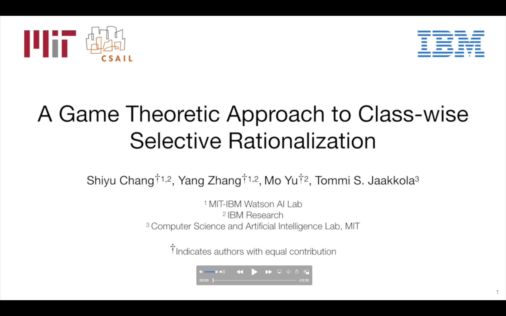

# A Game Theoretic Approach to Class-wise Selective Rationalization
This repo contains the Tensorflow implementation of [A Game Theoretic Approach to Class-wise Selective Rationalization](https://arxiv.org/abs/1910.12853) (CAR).  To make this repo neat and light-weight, we release the core code with a single multi-aspect dataset (i.e. the beer review) for the demo purpose.  If you are interested in reproducing the exact results for other datasets, please contact us, and we are very happy to provide the code and help.

A short video explains the main concepts of our work.  For more detail about CAR, Please see our [NeurIPS 2019 paper](https://arxiv.org/abs/1910.12853).  If you find this work useful and use it in your research, please consider citing our paper.

[](https://youtu.be/DFtJL7PcGFA)

```
@article{chang2019rationale,
  title={A Game Theoretic Approach to Class-wise Selective Rationalization},
  author={Chang, Shiyu and Zhang, Yang and Yu, Mo and Jaakkola, Tommi},
  journal={arXiv preprint arXiv:1910.12853},
  year={2019}
}
```

## Getting Started
Below is the step-by-step instruction for running our code.  After cloning the repo, please first run the following script to download the dataset and the pre-trained word embeddings.

```bash
sh download_data.sh
```
After the download, you will now see two folders in your main directory, which are `data` and `embeddings`.  It is worth mentioning that, aspect 0,1, and 2 in the dataset are corresponding to the appearance, aroma, and palate aspect, respectively.

Next, you need to properly set up your virtual environment and install all dependencies from the `requirements.txt` using the commend:
```bash
pip install -r requirements.txt
```

Once all packages are installed, now you are free to generate some interesting rationales by using the following commends  under your main directory.
```bash
sh scripts/run_beer_0.sh
```
You are expected to see a similar result as the following.
```console
The annotation performance: sparsity: 11.9761, precision: 76.2066, recall: 49.2948, f1: 59.8653
```
**Tested environment:**
Tensorflow: 1.12, CUDA driver: 384.183, and CUDA version: 9.0

## Final Words
That's all for now and hope this repo is useful to your research.  For any questions, please create an issue and we will get back to you as soon as possible.
